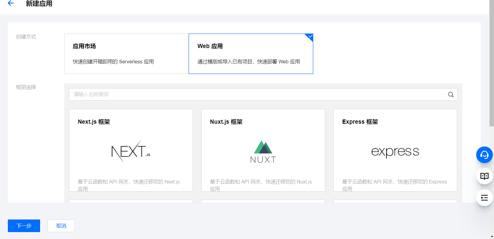

# 部署
## 一、使用serveless(推荐)
1、**新建serveless应用**
* (1)、前往[serverless](https://console.cloud.tencent.com/sls)控制台

图片来源于腾讯云

* (2)、**配置参数**
- `上传参数`选择github,授权后选择nuxt开发应用仓库,其他参数不变
- `高级配置`,勾选`静态资源托管`,开启`自定义域名`[配置方法](https://cloud.tencent.com/document/product/628/11791)
- `函数配置`,内存建议稍微调到`1024`,以防失败,开启`固定出口ip`

更多[部署方法](https://www.nuxtjs.cn/faq)参考**DEPLOYMENT**章节

<svg t="1639730063216" class="icon" viewBox="0 0 1056 1024" version="1.1" xmlns="http://www.w3.org/2000/svg" p-id="2076" width="64" height="64"><path d="M528 0c249.952 0 458.08 179.136 503.04 416h-65.344C921.76 214.72 742.464 64 528 64c-247.424 0-448 200.576-448 448s200.576 448 448 448c225.696 0 412.384-166.88 443.456-384h64.576c-31.488 252.576-246.944 448-508.032 448-282.784 0-512-229.216-512-512s229.216-512 512-512z m0 192l288 160v130.048l-158.336 94.624V512l94.336-55.776V384l-60.864-32-130.624 64v224l-127.872 73.248L528 768l224.256-122.304a64 64 0 1 1 27.04 46.752L528 832 240 672v-139.04l160-84.96v64l-96 48.32V640l64.32 37.536 127.776-74.56V384l140.224-71.04L528 254.624l-224.096 125.568L304 384a64 64 0 1 1-27.264-52.416L528 192z" fill="#0052D9" p-id="2077"></path></svg>

